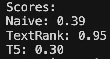

# Simplify English 

## Problem Statement

There are many individuals who's native language may not be English, hence making it difficult to understand articles, papers, or other documents. This project is to generate summaries in various different reading levels selected by the user while attempting to maintain the meaning and key information of the original text. Currently, the code is set up to parse Medium articles but further improvements for general uses will be done.

## Data Sources

The project uses web-scraped content from the user-inputted URL via the UI. For the summaries created in this repository, [this](https://medium.com/the-year-of-the-looking-glass/how-to-think-about-your-career-abf5300eba08) Medium article was used. 

## Review of Relevant Literature

There are a few other pieces of literature/code that have been created to resolve the same problem statement. Examples include: [keep-it-simple-ai](https://github.com/egehanyorulmaz/keep-it-simple-ai) and [SimplifAI](https://github.com/saradiazdelser/SimplifAI). However, there are major differences between the existing and this project's approach:
- This project uses three different approaches (Naive, TextRank, and T5) which allows for different perspectives on summarizing versus just a single model. The UI, however, only uses TextRank as it's more accurate and performant currently.
- This project also provides a seamless UI that allows users to input Medium URL's
- Models are also using various different types of tuning such as summary ratios, keyword features, and damping factors rather than a basic classification approach.
- Evaluation metrics are also different in this project compared to the others which is explained below.

## Models & Evaluation

### Models Used:
- **Keyword-Based Model (Naive Approach)**: This model uses TF-IDF to identify the keywords in the text and then ranks them based on how many are contained in each sentence.
- **TextRank (Classic Approach)**: This model builds a graph where sentences are nodes and edges are the similarity between them.
- **T5 (Deep Learning Approach)**: This model is a transformer that is pre-trained and generates new content that summarizes the original text.

### Evaluation Process:
- **Semantic Similarity** - The sentence_transformers package is used to convert the summaries created for each model into embeddings, which captures the meaning of the text. Then, the cosine similarity metric is used to calculate a score between 0 and 1 for each summary's embedding. Scores closer to 1 show better semantic preservation.

## English Levels and Model Output Impact (Naive and TextRank)
- **Beginner Level**: This level contains 40% of the original sentences while using 50 keywords that are common
- **Intermediate Level**: This level contains 30% of the original sentences while using 100 keywords of both common and less frequent words
- **Advanced Level**: This level contains 20% of the original sentences while using 150 keywords which includes less frequent words

## English Levels and Model Output Impact (T5)
T5 doesn't follow the same english level definitons as the other two models since it's an abstractive approach. Due to new content being generated for the summary, it can't use parameters such as summary_ratio since it isn't pulling and using information directly from the original text.

- **Beginner Level**: The summary contains character size between 100-600 with a prompt that states "summarize in simpler terms." Also contains a lower threshold which allows for more repitition.
- **Intermediate Level**: The summary contains character size between 150-800 while using a prompt that states only "summarize." The threshold is also 1.0 so it's neutral.
- **Advanced Level**: The summary contains character size between 200-1000 and uses the prompt that states "summarize comprehensively." It also has a higher threshold of 1.5 so there's less reptition.

## Data Processing Pipeline

1. **Web Scraping** (`scripts/scraping.py`)
   - Extract content from the user-inputted URL using BeautifulSoup

2. **Preprocessing** (Multiple approaches)
   - **Naive preprocessing** (`scripts/preprocessing_naive.py`): NLTK-based tokenization, stop word removal, lemmatization
   - **TextRank preprocessing** (`scripts/preprocessing_textrank.py`): spaCy-based text processing
   - **T5 preprocessing** (`scripts/preprocessing_t5.py`): Limited text processing as the model performs steps as well

3. **Models**
   - Each preprocessing file routes to the respective model file that helps generate the summaries

## Results and Conclusions

### Performance Comparison:
- 
- This is the performance between the raw and summary files using semantic similarity. There is definitely room for improvement as the deep learning model configured correctly, should be the best.

## Ethics Statement

This project allows web information to be more accessible for individuals where English may not be their first language by providing summaries. This tool is designed to retain the message of the original content while supporting readers with different literary levels. Although the summaries can introduce biases in the training data and miss complex topics, it is mitigated by using different models.

## How to run the application

1. **Clone the repository:**
   ```bash
   git clone git@github.com:adityaraju926/simplify-english.git
   ```

2. **Install dependencies:**
   ```bash
   pip install -r requirements.txt
   ```

3. **Install spaCy model:**
   ```bash
   python -m spacy download en_core_web_sm
   ```

4. **Download NLTK:**
   ```bash
   python -c "import nltk; nltk.download('punkt'); nltk.download('stopwords'); nltk.download('wordnet')"
   ```

5. **Run the app**
   ```bash
   streamlit run page.py
   ```

### File Structure:
```
simplify-english/
├── data/                   
│   ├── naive/             
│   │   ├── summary_naive_beginner.txt
│   │   ├── summary_naive_intermediate.txt
│   │   └── summary_naive_advanced.txt
│   ├── textrank/          
│   │   ├── summary_textrank_beginner.txt
│   │   ├── summary_textrank_intermediate.txt
│   │   └── summary_textrank_advanced.txt
│   ├── t5/                
│   │   ├── summary_t5_beginner.txt
│   │   ├── summary_t5_intermediate.txt
│   │   └── summary_t5_advanced.txt
│   ├── raw.txt            
│   ├── preprocessed_naive.txt
│   ├── preprocessed_textrank.txt
│   └── preprocessed_t5.txt
├── models/                
│   ├── naive.py           
│   ├── textrank.py        
│   └── t5.py              
├── scripts/               
│   ├── scraping.py        
│   ├── preprocessing_naive.py    
│   ├── preprocessing_textrank.py 
│   ├── preprocessing_t5.py       
│   └── evaluation.py      
├── page.py                
├── requirements.txt       
└── README.md            
```